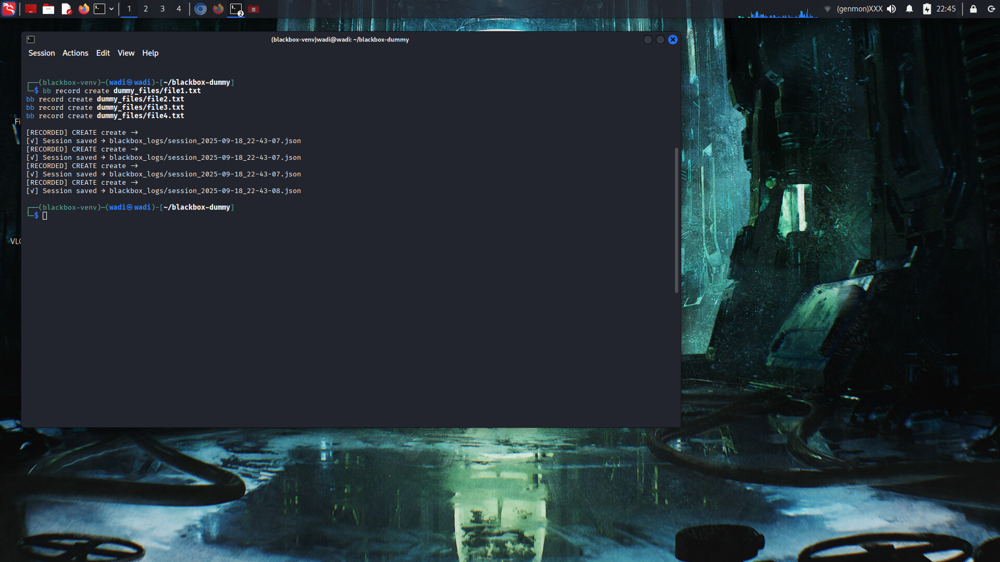
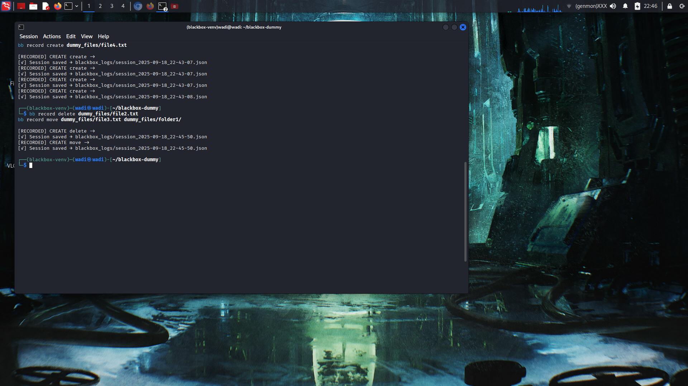
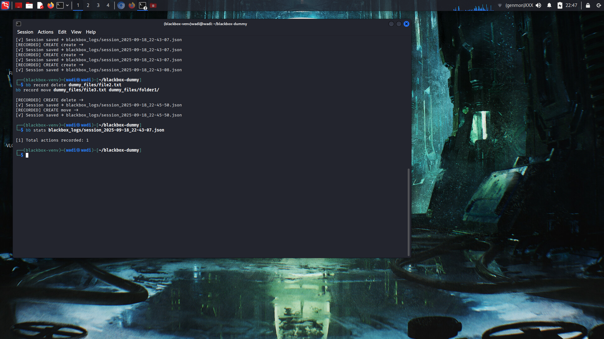
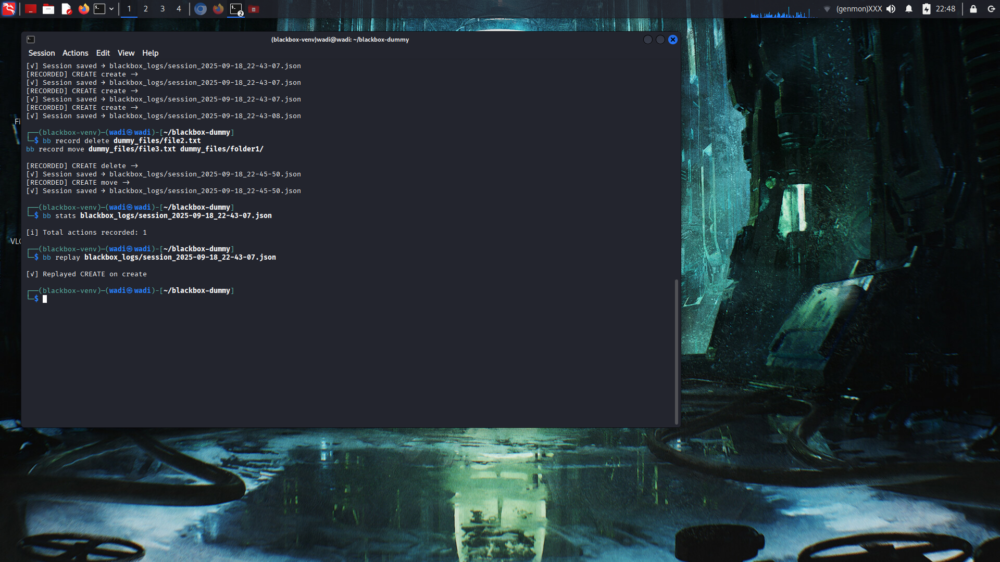
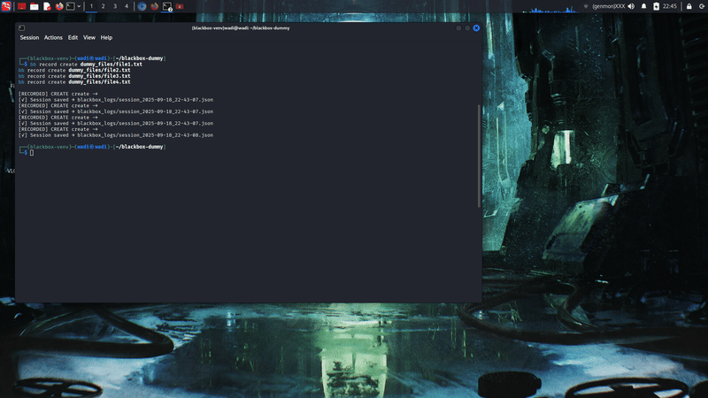

# 🚀 Blackbox Recorder — Terminal Activity Tracker

**Track your terminal file actions like a pro** — create, move, delete, replay, and produce visual proofs. Perfect for demos, auditing, and professional documentation.

---

## ✨ Features

- **Record** file actions: `create`, `delete`, `move`, `rename`  
- **Replay** recorded sessions exactly as they happened  
- **Generate GIF proofs** of terminal actions  
- **View stats** of recorded actions for auditing  
- **Safe dummy file** usage — your real files stay untouched  
- **Recruiter & client friendly** documentation

---

## 🛠️ Requirements  

python3 -m venv blackbox-venv
source blackbox-venv/bin/activate
pip install -r requirements.txt
pip install blackbox-recorder==1.0.0

🎯 Usage Guide
1️⃣ Record a dummy session

cd ~/blackbox-dummy
bb record create dummy_files/file1.txt
bb record create dummy_files/file2.txt
bb record create dummy_files/file3.txt
bb record create dummy_files/file4.txt
bb record delete dummy_files/file2.txt
bb record move dummy_files/file3.txt dummy_files/folder1/
bb record move dummy_files/file4.txt dummy_files/folder2/
bb record move dummy_files/file1.txt dummy_files/file1_renamed.txt

2️⃣ Replay the latest session

LATEST_SESSION=$(ls -t ../blackbox_logs | grep session | head -n1)
bb replay ../blackbox_logs/$LATEST_SESSION

3 Generate the GIF proof

bb visualize ../blackbox_logs/$LATEST_SESSION

 
📸 Proofs (Screenshots & GIF)

🔹 Step 1 — Initial Dummy File Creation

🔹 Step 2 — Delete & Move Operations

🔹 Step 3 — Stats Output

🔹 Step 4 — Replay Output

🔹 Step 5 — GIF Generation Success

🎞️ Full Session Demo GIF

## 📄 License  
This project is licensed under the MIT License — see the [LICENSE](LICENSE) file for details.  

---

## 🤝 Contributing  
Contributions, issues, and feature requests are welcome!  
Feel free to open an [issue](../../issues) or submit a PR.  

---

## ⭐ Support & Recognition  
If you find this project useful, please ⭐ the repo — it helps more people discover it!  
